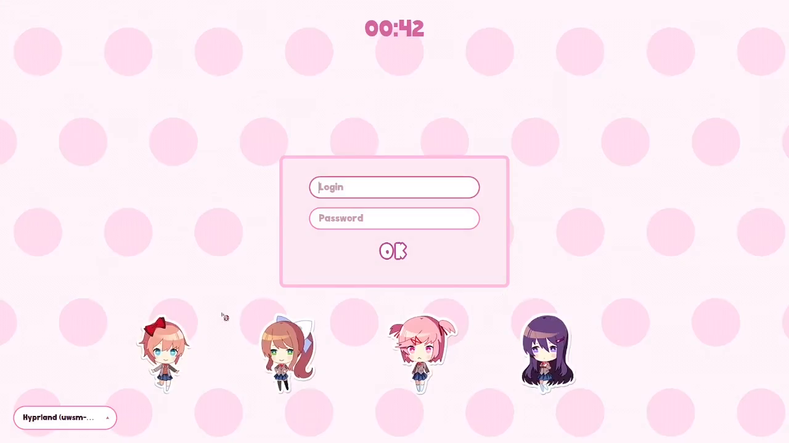
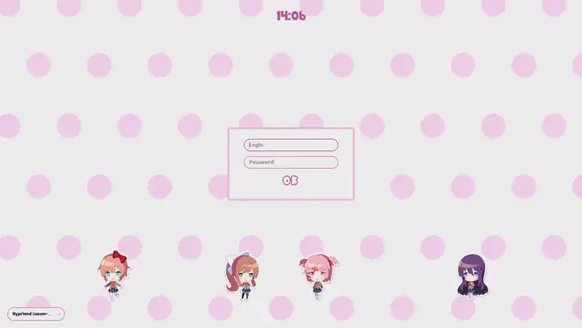
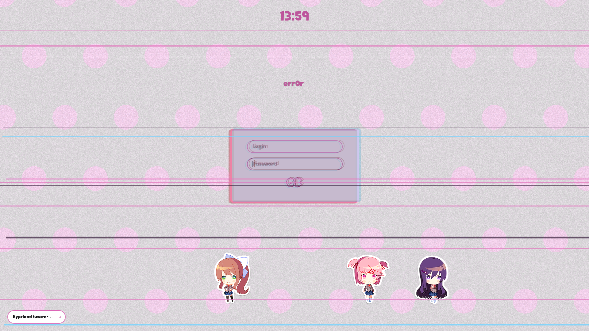
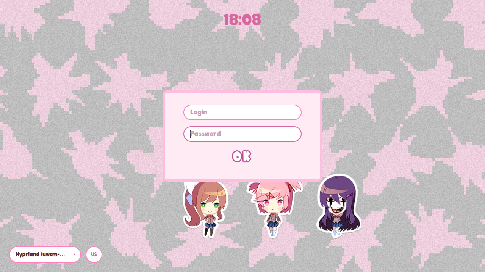
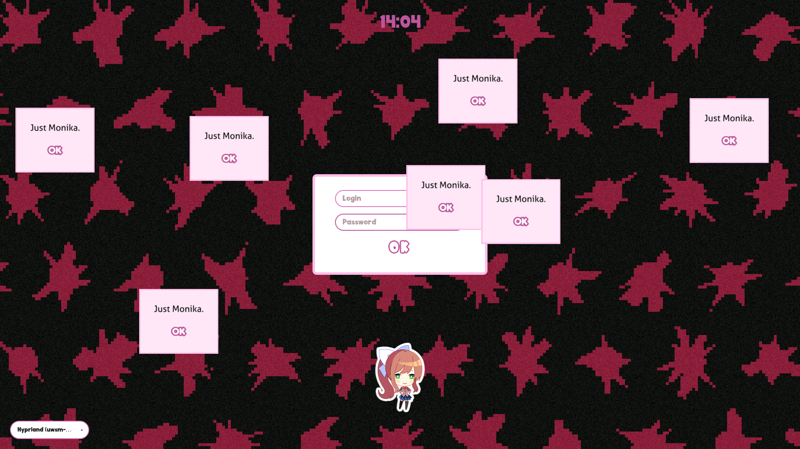

<div align="center">

# DDLC theme for SDDM

**A Doki Doki Literature Club login screen** o(^▽^)o


[](LICENSE)
[](ASSETS.md)
[](https://github.com/rokokol/ddlc-sddm-theme/actions/workflows/build.yml)





*three wrong passwords in a row — [the full recording](docs/demo.mp4)*

[Русский](README.ru.md)

</div>

Plain QML and INI, no Nix interpolation inside the theme, so it installs on any distribution with an ordinary `cp`. Came over from **my rice, [rokokol/huix](https://github.com/rokokol/huix)**

> Unaffiliated with and not endorsed by Team Salvato. The sprites and the cursor are theirs — see [ASSETS.md](ASSETS.md)

## Failures accumulate

Every wrong password runs a glitch of about a second — the panel shakes, RGB-split through `QtQuick.Effects`, random scanlines, flickering corrupted text — and leaves a mark that does not go away

<div align="center">

</div>

| | what changes |
| --- | --- |
| **1st** | film grain appears, Sayori leaves, Yuri cuts, the background darkens a little |
| **2nd** | the even dot outlines break into ragged spikes, JPEG artefacts kick in, Yuri turns distorted |
| **3rd** | Just Monika |

<div align="center">


</div>

In the easter egg only Monika remains, sliding to the centre while everyone else fades out. The background goes black, the dots turn red, and their drift comes to a smooth stop before accelerating the other way. "Just Monika" windows open across the screen one after another, each closing on click. A successful login clears it, and so does a minute of silence

## Install

### NixOS

```nix
{
  inputs.ddlc-sddm-theme.url = "github:rokokol/ddlc-sddm-theme";

  # in your configuration
  imports = [ inputs.ddlc-sddm-theme.nixosModules.default ];

  services.displayManager.sddm = {
    enable = true;
    wayland.enable = true;
  };

  ddlc.sddm.enable = true;
}
```

The module installs the theme and the cursors, selects them in the greeter and sets `QML_DISABLE_DISK_CACHE=1` — under `/nix/store` every file has mtime 1970, and without it Qt's QML cache serves the previous version of the theme forever

Everything this project owns lives under `ddlc.sddm`: `settings`, `package`, and `cursors.{enable,package,size}`. Enabling SDDM itself, Wayland and the compositor are not ours to own, so they stay where NixOS put them

### Any other distribution

```sh
git clone https://github.com/rokokol/ddlc-sddm-theme
cd ddlc-sddm-theme
sudo ./install.sh
```

With no flags it does everything: copies `theme/` into `/usr/share/sddm/themes/ddlc`, copies the cursors into `/usr/share/icons/sayori-cursors` and writes `/etc/sddm.conf.d/10-ddlc.conf` selecting both. Talk it out of that with `--no-configure` (leave `/etc` alone), `--no-cursors` and `--prefix`

Nothing has to be built: the theme and the cursors are committed ready to use, so installing is a copy. ImageMagick and `xcursorgen` are only needed to regenerate the cursors from their source frames through `cursors/build-cursors.sh`

## Fonts

`theme.conf` asks for two families that are **not** shipped:

- `font=Doki` — the game's font, Team Salvato's. Qt falls back to its default sans, which looks fine but not right. Any rounded font gets you closer
- `iconFont=DepartureMono Nerd Font` — only the three power glyphs in the bottom right corner come from it. Without a Nerd Font they render as boxes, so point this at whichever one you have

## Configuration

Everything lives in the `[General]` block of `theme/theme.conf`, read from QML as `config.<key>`:

| key | default | what it does |
| --- | --- | --- |
| `font` | `Doki` | main font family |
| `iconFont` | `DepartureMono Nerd Font` | glyphs on the power buttons |
| `bgColor` | `#FFFFFF` | background |
| `accentPink` / `deepPink` | `#DD77BB` / `#BB5599` | borders and accents |
| `dotColor` | `#FFDBF0` | the dots |
| `corruptDot` | `#8C1132` | the dots in easter-egg mode |
| `dotSpacing` / `dotRadius` | `200` / `40` | grid step and dot radius |
| `scrollDuration` | `14000` | drift period of the background, ms |
| `panelColor` / `panelBorder` | `#FFFFFF` / `#FFBDE1` | login panel |
| `okOutline` | `#BB5599` | outline of the OK button |
| `textDark` / `textLight` | `#222222` / `#FFFFFF` | text on a light and on a pink ground |
| `errorRed` | `#CC0C29` | the failed-password line |
| `placeholderColor` | `#B59CA1` | prompt inside the empty password field |
| `rowHighlight` | `#FFDBF0` | selected row of the session list |
| `splitWarm` / `splitCool` | `#CC0C29` / `#72D0FA` | the two channels the RGB-split pulls apart |
| `glitchPink` / `glitchCyan` / `glitchDark` | `#DD77BB` / `#72D0FA` / `#361B39` | scanlines across a glitch |
| `corruptOutline` | `#40222222` | shadow under the corrupted text — `textDark` at 25%, and the one key Qt reads as `#AARRGGBB` |
| `glitchRgbSplit` | `true` | turn off if RGB-split misbehaves on your hardware |

`theme.conf` is **generated**, not written: `nix/theme-conf.nix` takes the colours from [**ddlc-palette**](https://github.com/rokokol/ddlc-palette), which reads them off [ddlc.moe](https://ddlc.moe/) (the dot grid is that site's own 200×200 background tile, down to the radius), and adds the keys the palette has no opinion about. The result is committed, so installing is still a `cp` on a machine without Nix

To change a colour, change the palette and run `nix run .#write-theme-conf`. CI regenerates the file and diffs it against the committed one, so a hand-edit fails the build rather than quietly forking the palette

On NixOS, set them as options instead of editing the file — the module rebuilds the theme with them merged into `theme.conf`:

```nix
ddlc.sddm.settings = {
  font = "Comfortaa";
  dotColor = "#E8D5FF";
  glitchRgbSplit = false;
};
```

## Preview without logging out

```sh
nix run github:rokokol/ddlc-sddm-theme#preview
```

That opens the greeter in a window in `--test-mode` against the built theme. Or by hand on any distribution:

```sh
env -u QML2_IMPORT_PATH -u QML_IMPORT_PATH -u QT_PLUGIN_PATH \
  sddm-greeter-qt6 --test-mode --theme ./theme
```

Unsetting those three matters: the QML and plugin paths of your running session shadow the greeter's own Qt and it simply does not start

Test-mode has no SDDM daemon, so a real `loginFailed` never arrives — **press F8** to fake a wrong password. Three presses reach the easter egg

## Layout

```
theme/          Main.qml, theme.conf, metadata.desktop, components/, assets/
                — self-contained, copy it anywhere
cursors/        the prebuilt XCursor theme, its source frames and the script
                that regenerates one from the other
nix/            theme.nix, cursors.nix, module.nix
```

QML file names are CamelCase because in QML the file name *is* the type name

## Credits

Doki Doki Literature Club is by [Team Salvato](https://teamsalvato.com/). This is non-commercial fan content, and the licensing of every bundled image is spelled out in [ASSETS.md](ASSETS.md). The code is MIT
